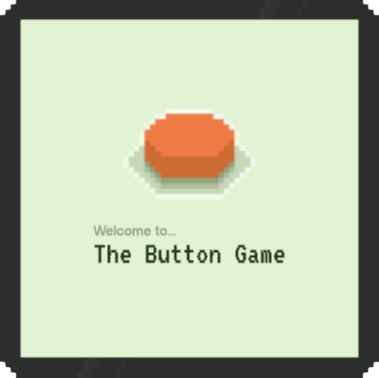

  

An experimental onchain onframe game for Farcaster.

The premise of the game is simple: every user gets 1 button press and as a community, we need to make sure the button survives as long as possible. Every time someone presses the button, it resets its timer to 60 minutes. If no one presses it in that time, the game is over.

## Technologies used

- [Dojo](https://www.dojoengine.org/en/), a provable game engine and toolchain for building onchain games and autonomous worlds.
- [frog](https://frog.fm/) Vercel serverless template
- [Slot](https://github.com/cartridge-gg/slot), a toolchain for rapidly spinning up Katana and Torii instances.

## Local Development

Want to give this example a try? Clone the repo locally!

[Make sure Dojo is installed](https://book.dojoengine.org/getting-started/quick-start) (`curl -L https://install.dojoengine.org | bash`). This repo uses `v0.5.1`, which is latest at the time of writing. If you end up with a later version, be sure to run `dojoup --version 0.5.1`.

### Setting up your local chain

Run the following command

- `katana --disable-fee`

Then in the `contracts` folder, run these commands

- `sozo build`
- `sozo migrate`
- `./scripts/default-auth.sh` (note down both the World address and the Button address from this output)

With the Button contract address, run

`sozo execute $BUTTON_ADDRESS initialize`

Then spin up Torii with your world address

`torii --world $WORLD_ADDRESS`

### Spinning up the frontend

Copy `.env.example` inside `web` and rename it to `.env`. Fill in the missing values.

Then, also inside `web`, run:

- `bun install`
- `bun dev`

Navigate to `http://localhost:5173/dev` and you should see the home frame!
